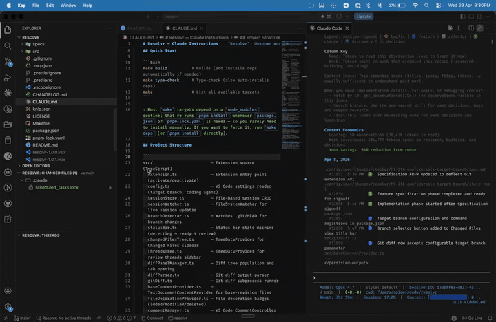

# Resolvr

Code review inside VS Code. Open diffs, leave threaded comments on any line, then hand the open threads to your AI agent to work through. Session files live on your machine. No account needed, no server to run.



## Features

- Threaded inline comments on any line, using VS Code's native Comments API
- Changed files tree in the Source Control sidebar with diff stats
- Side-by-side diff panel
- Live updates as session files change on disk
- "Resolve with AI": spawns your configured agent in a terminal to tackle open threads

## Install

From the VS Code Marketplace:

```bash
code --install-extension ugudlado.resolvr
```

Or grab the `.vsix` from the [latest release](https://github.com/ugudlado/resolvr/releases):

```bash
code --install-extension resolvr-<version>.vsix
```

## How it works

Open changed files in the sidebar and comment on any line. Threads stay open until resolved. Reply, reopen, or mark as won't fix. When you're ready, hit "Resolve with AI" and your agent picks up the open threads inline.

Sessions are stored in `.review/sessions/` as JSON files you can diff, commit, or ignore.

## Development

```bash
git clone https://github.com/ugudlado/resolvr.git
cd resolvr
pnpm install
```

```bash
pnpm build       # bundle the extension
pnpm watch       # watch mode
pnpm type-check  # type check
pnpm format      # prettier
```

### Packaging

```bash
pnpm package
```

### Debug in VS Code

Press `F5` to launch the Extension Development Host.

## Contributing

1. Fork and create a feature branch
2. `pnpm install`
3. Make changes, run `pnpm type-check`
4. `pnpm build`
5. Open a pull request

## License

MIT. See [LICENSE](./LICENSE).
