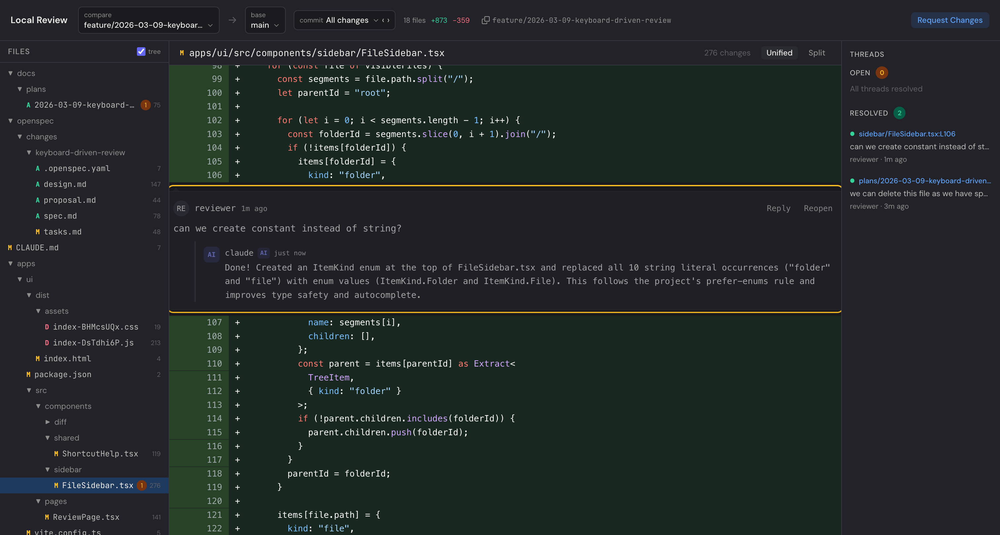
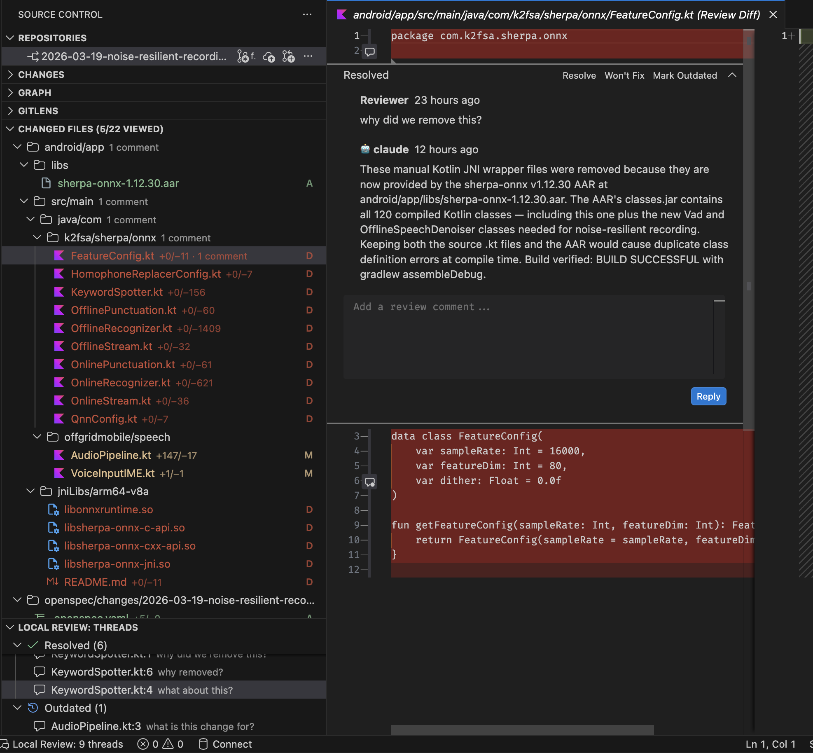

# local-review

Local code review for Claude Code — review diffs, leave threaded comments, and let Claude resolve them. Works across three surfaces that share the same review sessions:

- **Web UI** — Full-featured browser interface for reviewing diffs, managing threads, and tracking tasks
- **VS Code extension** — Inline annotations, file tree, and diff panel right in your editor
- **Claude Code CLI** — Resolve threads automatically via `/local-review:resolve`

All three read and write the same session files, so you can start a review in the browser, continue in VS Code, and have Claude resolve threads from the CLI — everything stays in sync.

## Install

**Step 1:** Add the marketplace (one-time):

```
claude plugin marketplace add ugudlado/claude-marketplace
```

**Step 2:** Install the plugin:

```
claude plugin install local-review@ugudlado
```

**Step 3:** Open the review UI:

```
/local-review:open
```

## Web UI

The browser interface gives you the full review experience — file sidebar, syntax-highlighted diffs, inline threaded comments, and a command palette.



### Feature dashboard

See all active and completed features at a glance with status badges, thread counts, file counts, and task progress. Switch between workspaces to view features across multiple repos.


### Task tracking

View implementation tasks organized by phase, with status indicators and expandable task details.


### Keyboard shortcuts

Press `?` for the shortcut help overlay:

- `⌘K` / `Ctrl+K` — Command palette (fuzzy search files, threads, actions)
- `j` / `k` — Navigate between threads
- `r` — Resolve focused thread
- `h` / `l` — Focus sidebar / diff panel

## VS Code Extension

Review code without leaving your editor. The extension surfaces review sessions directly in VS Code's Source Control sidebar — changed files with diff stats, inline comment threads via the native Comments API, and a dedicated diff panel.



The extension works serverlessly — it reads and writes session files directly, with no server dependency. File watchers keep everything in sync: comments added in the browser appear in VS Code, and vice versa.

Install the `.vsix` from the [latest release](https://github.com/ugudlado/local-review/releases):

```bash
code --install-extension local-review-vscode-<version>.vsix
```

## Claude Code Integration

Claude connects all the pieces. When you're done reviewing, Claude reads every open thread and responds:

- **Applies a fix** — when the issue is clear and the solution is unambiguous
- **Replies with an explanation** — when the comment asks "why"
- **Asks a clarifying question** — when context is missing or multiple valid approaches exist

Trigger resolution from the web UI with "Request Changes", or directly from Claude Code:

```
/local-review:resolve
```

The `review-resolver` subagent processes each thread independently, writing replies back to the same session files that the web UI and VS Code extension read.

## Commands

| Command                           | Description                                                 |
| --------------------------------- | ----------------------------------------------------------- |
| `/local-review:open [feature]`    | Open the review UI, optionally navigate to a feature        |
| `/local-review:resolve [session]` | Resolve all open threads in the latest or specified session |

## How It Works Together

```
You review code          Claude resolves threads       You see replies
 (Web UI or VS Code)      (Claude Code CLI)             (Web UI or VS Code)
       │                        │                              │
       ▼                        ▼                              ▼
  ┌─────────────────────────────────────────────────────────────────┐
  │                .review/sessions/*.json                          │
  │         Shared session files — single source of truth           │
  └─────────────────────────────────────────────────────────────────┘
```

1. **Review** — Open diffs in the web UI or VS Code, add threaded comments on any line
2. **Request changes** — Click "Request Changes" in the UI or run `/local-review:resolve`
3. **Claude responds** — Each thread gets a fix, explanation, or clarifying question
4. **Continue** — See Claude's replies inline, resolve or follow up

## Architecture

The plugin ships with three apps:

- **`apps/server`** — Standalone Hono server (REST API + WebSocket). Bundles into a single `dist/index.js` via esbuild for zero-install plugin support. Multi-repo via workspace registry.
- **`apps/ui`** — React frontend (Vite + Tailwind CSS v4 + shadcn/ui). Served as static files by the server.
- **`apps/vscode`** — VS Code extension (esbuild bundle). Reads session files directly — no server dependency.

The `SessionStart` hook auto-starts the server and registers the current repo as a workspace — no `pnpm install` or build step needed after plugin installation.

## Development

```bash
git clone https://github.com/ugudlado/local-review.git
cd local-review
pnpm install
pnpm dev                      # Start server (tsx watch mode)
pnpm -C apps/ui dev           # Start Vite dev server (HMR for UI work)
```

```bash
pnpm -C apps/server build     # Rebuild server bundle (esbuild)
pnpm -C apps/ui build         # Build UI for production
pnpm -C apps/ui test:unit     # Run unit tests
pnpm type-check               # Type-check all workspaces
pnpm lint                     # Lint all files (ESLint 9)
pnpm format                   # Format all files (Prettier + Tailwind plugin)
```

For more development details (workspace commands, architecture, gotchas), see [CLAUDE.md](./CLAUDE.md).

## Contributing

1. Fork the repo and create a feature branch
2. `pnpm install && pnpm dev`
3. Make your changes — validate with `pnpm type-check`
4. Rebuild server if changed: `pnpm -C apps/server build`
5. Open a pull request

## License

MIT — see [LICENSE](./LICENSE)
